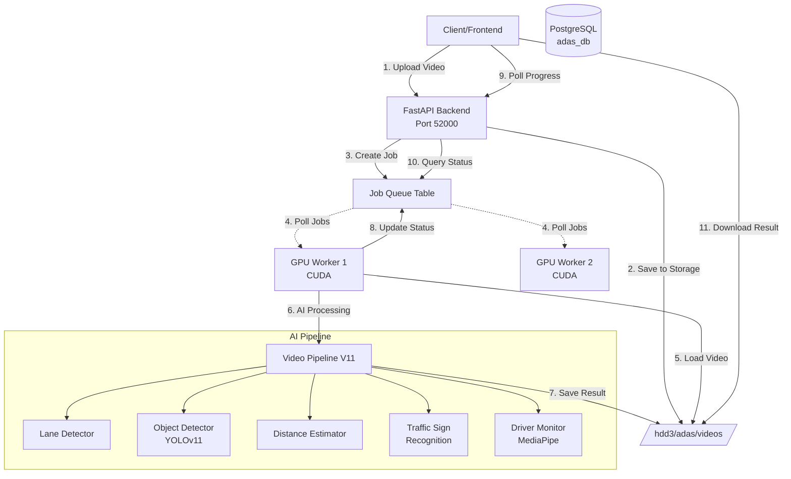
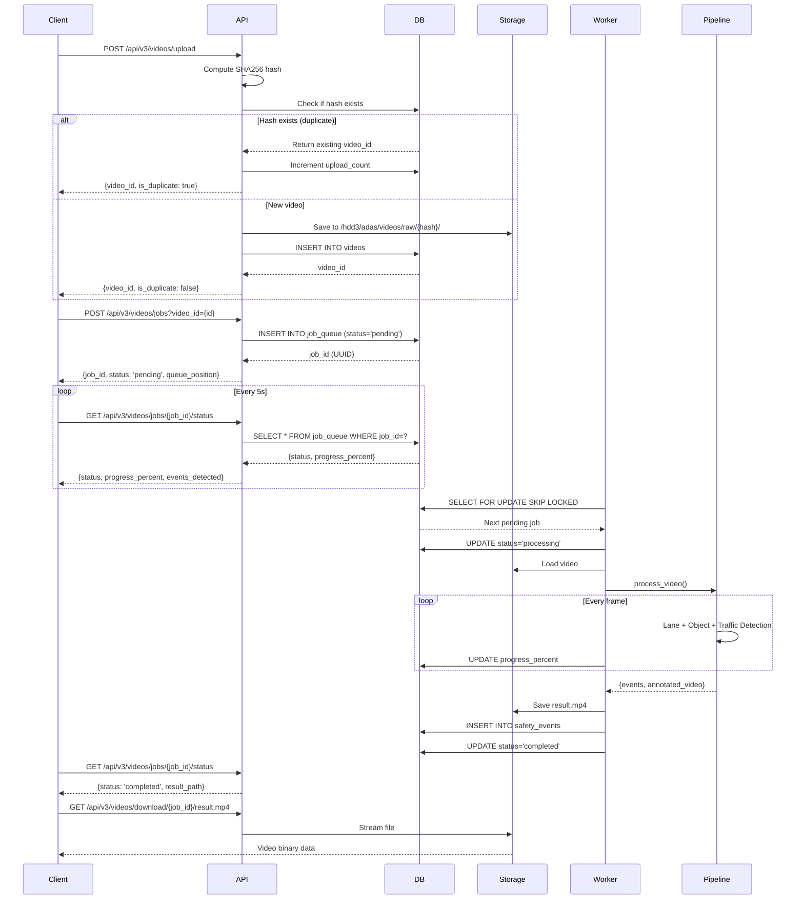
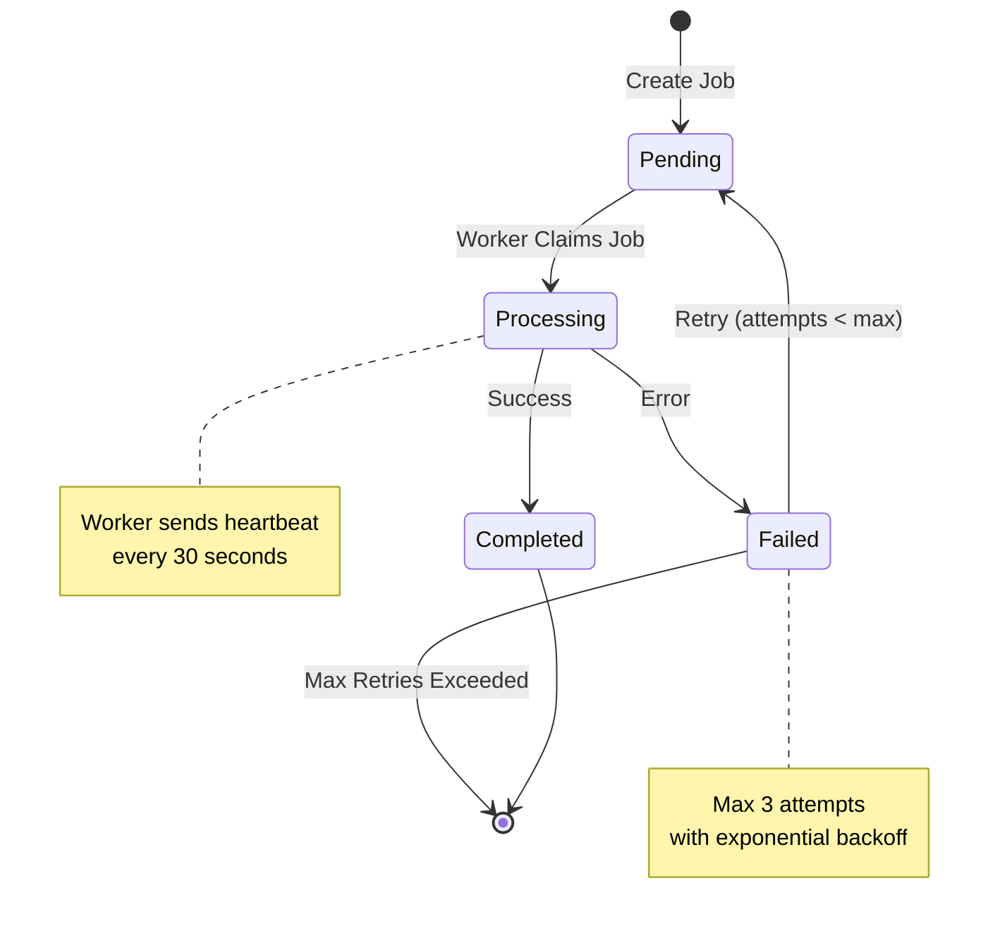

# ADAS System v3.0 - Complete API Documentation

**Author:** Senior Backend AI Engineer & Technical Writer  
**Date:** January 3, 2026  
**Version:** 3.0.0  
**Hardware:** NVIDIA T4 GPU (16GB VRAM), PostgreSQL Database  

---

## Table of Contents

1. [System Overview](#system-overview)
2. [Architecture & Pipeline Flow](#architecture--pipeline-flow)
3. [API Endpoints](#api-endpoints)
   - [Video Processing API](#video-processing-api)
   - [Driver Monitoring API](#driver-monitoring-api)
   - [Streaming API](#streaming-api)
   - [Dataset Management API](#dataset-management-api)
   - [Model Management API](#model-management-api)
4. [Error Handling & Status Codes](#error-handling--status-codes)
5. [Data Contracts](#data-contracts)
6. [Performance Specifications](#performance-specifications)
7. [Test Cases](#test-cases)

---

## System Overview

ADAS (Advanced Driver Assistance System) v3.0 is a production-grade AI-powered video analysis platform designed for:

- **Dashcam Video Analysis:** Lane detection, object tracking, collision warning, traffic sign recognition
- **Driver Monitoring:** Fatigue detection, distraction analysis, eye closure monitoring
- **Real-time Streaming:** HTTP polling-based real-time detection
- **Async Job Processing:** PostgreSQL-backed job queue with GPU worker pool

### Key Features

✅ **Async Video Processing:** Upload video → Background AI processing → Download annotated result  
✅ **Hash-based Deduplication:** SHA256 hashing prevents duplicate storage  
✅ **Job Queue Management:** ACID-compliant job queue with FOR UPDATE SKIP LOCKED  
✅ **GPU Worker Pool:** Supervisor-managed workers with model persistence  
✅ **Real-time Streaming:** HTTP polling (100-200ms latency)  
✅ **Comprehensive Detection:** YOLOv11, MediaPipe, lane detection, distance estimation  

### Hardware Requirements

- **GPU:** NVIDIA T4 (16GB VRAM) or equivalent
- **RAM:** 16GB minimum, 32GB recommended
- **Storage:** 500GB+ for video storage
- **Database:** PostgreSQL 14+

### Software Stack

- **Backend:** FastAPI + SQLAlchemy (Async)
- **AI Models:** YOLOv11n, MediaPipe Face Mesh
- **Database:** PostgreSQL 14 with asyncpg
- **Worker:** Python async worker with Supervisor

---

## Architecture & Pipeline Flow

### System Architecture Diagram



### Video Upload & Processing Flow



### Job Queue State Machine



---

## API Endpoints

### Video Processing API

#### 1. Check Video Exists (Deduplication)

Check if a video with the given SHA256 hash already exists before uploading.

**Endpoint:** `GET /api/v3/videos/check`

**Query Parameters:**
```typescript
{
  sha256: string  // 64-character hex string
}
```

**Response (200 OK):**
```json
{
  "exists": true,
  "video_id": 42,
  "sha256": "a1b2c3d4e5f6..."
}
```

**Response (Not Found):**
```json
{
  "exists": false,
  "video_id": null,
  "sha256": null
}
```

**Example Request:**
```bash
curl -X GET "http://localhost:52000/api/v3/videos/check?sha256=a1b2c3d4e5f6789012345678901234567890abcdef1234567890abcdef123456"
```

**Use Case:**
Client computes SHA256 of video file before upload. If exists, skip upload and directly create processing job with existing `video_id`.

---

#### 2. Upload Video

Upload a new video file with automatic deduplication.

**Endpoint:** `POST /api/v3/videos/upload`

**Request (multipart/form-data):**
```typescript
{
  file: File  // .mp4, .avi, .mov (max 500MB)
}
```

**Response (200 OK - New Upload):**
```json
{
  "video_id": 42,
  "sha256": "a1b2c3d4e5f6789012345678901234567890abcdef1234567890abcdef123456",
  "is_duplicate": false,
  "original_filename": "dashcam_highway.mp4",
  "size_bytes": 157286400
}
```

**Response (200 OK - Duplicate):**
```json
{
  "video_id": 42,
  "sha256": "a1b2c3d4e5f6...",
  "is_duplicate": true,
  "original_filename": "dashcam_highway.mp4",
  "size_bytes": 157286400
}
```

**Error Responses:**

**413 Payload Too Large:**
```json
{
  "detail": "File too large. Max: 500MB"
}
```

**422 Validation Error:**
```json
{
  "detail": [
    {
      "loc": ["body", "file"],
      "msg": "field required",
      "type": "value_error.missing"
    }
  ]
}
```

**Example Request:**
```bash
curl -X POST "http://localhost:52000/api/v3/videos/upload" \
  -F "file=@/path/to/video.mp4"
```

**Storage Path:**
```
/hdd3/adas/videos/raw/{sha256}/original.mp4
```

---

#### 3. Create Processing Job

Create a background AI processing job for an uploaded video.

**Endpoint:** `POST /api/v3/videos/jobs`

**Request (application/x-www-form-urlencoded):**
```typescript
{
  video_id: number       // From upload response
  video_type?: string    // "dashcam" | "in_cabin" (default: "dashcam")
  priority?: number      // 0-10, higher = more priority (default: 0)
}
```

**Response (200 OK):**
```json
{
  "job_id": "550e8400-e29b-41d4-a716-446655440000",
  "video_id": 42,
  "status": "pending",
  "priority": 5,
  "queue_position": 3
}
```

**Error Responses:**

**404 Not Found:**
```json
{
  "detail": "Video not found"
}
```

**Example Request:**
```bash
curl -X POST "http://localhost:52000/api/v3/videos/jobs" \
  -d "video_id=42" \
  -d "video_type=dashcam" \
  -d "priority=5"
```

**Processing Time Estimates:**
- 1-minute video: ~30-60 seconds (with GPU)
- 5-minute video: ~2-5 minutes (with GPU)
- 10-minute video: ~5-10 minutes (with GPU)

---

#### 4. Get Job Status (Polling)

Poll job status and progress. **Call this every 3-5 seconds** while job is processing.

**Endpoint:** `GET /api/v3/videos/jobs/{job_id}/status`

**Path Parameters:**
```typescript
{
  job_id: UUID  // From create job response
}
```

**Response (Processing):**
```json
{
  "job_id": "550e8400-e29b-41d4-a716-446655440000",
  "status": "processing",
  "progress_percent": 45,
  "current_step": "object_detection",
  "events_detected": 12,
  "result_path": null,
  "error_message": null,
  "processing_time_seconds": null
}
```

**Response (Completed):**
```json
{
  "job_id": "550e8400-e29b-41d4-a716-446655440000",
  "status": "completed",
  "progress_percent": 100,
  "current_step": null,
  "events_detected": 27,
  "result_path": "/hdd3/adas/videos/output/550e8400-e29b-41d4-a716-446655440000/result.mp4",
  "error_message": null,
  "processing_time_seconds": 145
}
```

**Response (Failed):**
```json
{
  "job_id": "550e8400-e29b-41d4-a716-446655440000",
  "status": "failed",
  "progress_percent": 23,
  "current_step": null,
  "events_detected": 0,
  "result_path": null,
  "error_message": "Failed to open video file. File may be corrupted or format not supported.",
  "processing_time_seconds": null
}
```

**Job Status Values:**
- `pending`: Waiting in queue
- `processing`: Currently being processed by worker
- `completed`: Successfully completed
- `failed`: Failed with error

**Current Step Values (when processing):**
- `initializing`: Loading video and models
- `object_detection`: Running YOLOv11 inference
- `lane_analysis`: Lane detection and tracking
- `rendering`: Rendering annotated video

**Error Responses:**

**404 Not Found:**
```json
{
  "detail": "Job not found"
}
```

**Example Request:**
```bash
curl -X GET "http://localhost:52000/api/v3/videos/jobs/550e8400-e29b-41d4-a716-446655440000/status"
```

**Frontend Polling Pattern:**
```javascript
async function pollJobStatus(jobId) {
  const maxAttempts = 600; // 30 minutes max
  let attempts = 0;
  
  while (attempts < maxAttempts) {
    const response = await fetch(`/api/v3/videos/jobs/${jobId}/status`);
    const data = await response.json();
    
    if (data.status === 'completed') {
      return data; // Success
    } else if (data.status === 'failed') {
      throw new Error(data.error_message);
    }
    
    // Update UI with progress
    updateProgressBar(data.progress_percent);
    
    // Wait 3 seconds before next poll
    await new Promise(resolve => setTimeout(resolve, 3000));
    attempts++;
  }
  
  throw new Error('Job timeout after 30 minutes');
}
```

---

#### 5. Download Processed Video

Download the annotated result video after job completes.

**Endpoint:** `GET /api/v3/videos/download/{job_id}/{filename}`

**Path Parameters:**
```typescript
{
  job_id: UUID    // Job ID
  filename: string // Usually "result.mp4"
}
```

**Response (200 OK):**
- Content-Type: `video/mp4`
- Binary video data stream

**Error Responses:**

**404 Not Found:**
```json
{
  "detail": "File not found"
}
```

**Example Request:**
```bash
curl -X GET "http://localhost:52000/api/v3/videos/download/550e8400-e29b-41d4-a716-446655440000/result.mp4" \
  --output result.mp4
```

**Example (Browser):**
```html
<a href="/api/v3/videos/download/550e8400-e29b-41d4-a716-446655440000/result.mp4" 
   download="processed_video.mp4">
  Download Processed Video
</a>
```

---

### Driver Monitoring API

#### 1. Analyze Driver Frame (Real-time)

Analyze a single frame from in-cabin camera for driver fatigue/distraction.

**Endpoint:** `POST /api/driver-monitor/analyze`

**Request (multipart/form-data):**
```typescript
{
  frame: string    // Base64-encoded image (JPEG/PNG)
  camera_id: string // Camera identifier (e.g., "cabin_cam_01")
}
```

**Response (200 OK):**
```json
{
  "success": true,
  "fatigue_level": 72,
  "distraction_level": 15,
  "eyes_closed": true,
  "head_pose": {
    "yaw": -12.5,
    "pitch": 8.3,
    "roll": -2.1
  },
  "alert_triggered": true,
  "recommendations": [
    "Take a break - high fatigue detected",
    "Consider stopping for rest"
  ]
}
```

**Field Descriptions:**
- `fatigue_level`: 0-100, higher = more fatigued
- `distraction_level`: 0-100, higher = more distracted
- `eyes_closed`: Boolean, true if eyes detected as closed
- `head_pose`: Euler angles in degrees
  - `yaw`: Left (-) / Right (+)
  - `pitch`: Down (-) / Up (+)
  - `roll`: Tilt left (-) / right (+)
- `alert_triggered`: True if immediate alert needed (fatigue > 70 OR distraction > 70 OR eyes_closed)
- `recommendations`: Array of actionable recommendations

**Alert Thresholds:**
- **Critical (alert_triggered=true):** fatigue > 70 OR distraction > 70 OR eyes_closed
- **Warning:** fatigue > 50 OR distraction > 50
- **Normal:** fatigue < 50 AND distraction < 50

**Example Request:**
```bash
# Base64 encode image first
IMAGE_B64=$(base64 -i frame.jpg)

curl -X POST "http://localhost:52000/api/driver-monitor/analyze" \
  -F "frame=$IMAGE_B64" \
  -F "camera_id=cabin_cam_01"
```

**Use Case:**
Mobile app captures frame from front camera every 1-2 seconds and sends to this endpoint for real-time driver monitoring.

---

### Streaming API

Real-time object detection via HTTP polling (no WebSocket).

#### 1. Start Streaming Session

**Endpoint:** `POST /api/stream/start`

**Request (application/json):**
```json
{
  "source": "webcam",
  "model_id": "yolo11n",
  "video_id": null,
  "config": null
}
```

**Request Schema:**
```typescript
{
  source: "webcam" | "video"   // Stream source
  model_id: string              // Model to use (default: "yolo11n")
  video_id?: number             // Required if source="video"
  config?: object               // Optional configuration
}
```

**Response (200 OK):**
```json
{
  "success": true,
  "session_id": "a1b2c3d4-e5f6-7890-1234-567890abcdef",
  "polling_url": "/api/stream/poll/a1b2c3d4-e5f6-7890-1234-567890abcdef",
  "message": "Streaming session started successfully"
}
```

**Error Responses:**

**400 Bad Request (Model not found):**
```json
{
  "detail": "Model 'yolo11m' not found"
}
```

**400 Bad Request (Model not downloaded):**
```json
{
  "detail": "Model 'yolo11m' not downloaded. Please download it first."
}
```

---

#### 2. Poll Stream Results

**Call this every 100-200ms** to get real-time detections.

**Endpoint:** `GET /api/stream/poll/{session_id}`

**Response (200 OK):**
```json
{
  "success": true,
  "detections": [
    {
      "class_name": "car",
      "confidence": 0.89,
      "bbox": [450, 320, 780, 550]
    },
    {
      "class_name": "person",
      "confidence": 0.76,
      "bbox": [120, 200, 280, 680]
    }
  ],
  "fps": 28.5,
  "latency_ms": 22.3,
  "frame_id": 145,
  "status": "processing"
}
```

**Detection Object:**
```typescript
{
  class_name: string      // "car", "person", "motorcycle", etc.
  confidence: number      // 0.0 - 1.0
  bbox: [x1, y1, x2, y2]  // Bounding box coordinates
}
```

**Example Polling Loop:**
```javascript
async function streamDetections(sessionId) {
  setInterval(async () => {
    const response = await fetch(`/api/stream/poll/${sessionId}`);
    const data = await response.json();
    
    if (data.status === 'stopped') {
      clearInterval(this);
      return;
    }
    
    // Update UI with detections
    renderBoundingBoxes(data.detections);
    updateFPS(data.fps);
  }, 150); // Poll every 150ms
}
```

---

#### 3. Process Single Frame (Webcam)

Send individual frames for processing (alternative to polling).

**Endpoint:** `POST /api/stream/frame`

**Request (multipart/form-data):**
```typescript
{
  session_id: string   // Session ID from /start
  frame: string        // Base64-encoded image
  timestamp?: number   // Optional frame timestamp
}
```

**Response (200 OK):**
```json
{
  "success": true,
  "detections": [
    {
      "class_name": "motorcycle",
      "confidence": 0.82,
      "bbox": [350, 280, 520, 480]
    }
  ],
  "latency_ms": 18.7,
  "frame_id": 42
}
```

---

#### 4. Stop Streaming

**Endpoint:** `POST /api/stream/stop`

**Request (application/json):**
```json
{
  "session_id": "a1b2c3d4-e5f6-7890-1234-567890abcdef"
}
```

**Response (200 OK):**
```json
{
  "success": true,
  "message": "Streaming session stopped. Processed 347 frames.",
  "total_frames": 347
}
```

---

### Dataset Management API

#### 1. List Datasets

**Endpoint:** `GET /api/dataset`

**Query Parameters:**
```typescript
{
  limit?: number    // Items per page (default: 50)
  page?: number     // Page number (default: 1)
  status?: string   // Filter: "uploaded" | "processing" | "ready" | "error"
  type?: string     // Filter: "video" | "image"
}
```

**Response (200 OK):**
```json
{
  "success": true,
  "data": [
    {
      "id": 1,
      "filename": "highway_test.mp4",
      "file_path": "/storage/videos/2026/01/highway_test.mp4",
      "video_url": "/api/video/download/1/highway_test.mp4",
      "file_url": "/api/dataset/1/download",
      "description": "Highway driving test footage",
      "file_size_mb": 245.8,
      "duration_seconds": 180.0,
      "uploaded_at": "2026-01-03T10:30:00Z",
      "status": "uploaded",
      "ready_for_training": false,
      "metadata": {
        "type": "video",
        "tags": ["highway", "daytime"],
        "original_filename": "highway_test.mp4"
      }
    }
  ],
  "total": 127,
  "page": 1,
  "limit": 50
}
```

---

#### 2. Upload Dataset Item

**Endpoint:** `POST /api/dataset`

**Request (multipart/form-data):**
```typescript
{
  file: File              // Video or image file
  description?: string    // Optional description
  type?: string           // "video" | "image" (default: "video")
  tags?: string           // Comma-separated tags
}
```

**Response (200 OK):**
```json
{
  "success": true,
  "message": "File uploaded successfully",
  "data": {
    "id": 128,
    "filename": "city_driving.mp4",
    "file_path": "/storage/videos/2026/01/city_driving.mp4",
    "file_size_mb": 312.5,
    "uploaded_at": "2026-01-03T14:25:00Z"
  }
}
```

---

#### 3. Get Dataset Item

**Endpoint:** `GET /api/dataset/{id}`

**Response (200 OK):**
```json
{
  "success": true,
  "data": {
    "id": 128,
    "filename": "city_driving.mp4",
    "file_path": "/storage/videos/2026/01/city_driving.mp4",
    "video_url": "/api/video/download/128/city_driving.mp4",
    "file_url": "/api/dataset/128/download",
    "description": "City driving with heavy traffic",
    "file_size_mb": 312.5,
    "duration_seconds": 240.0,
    "uploaded_at": "2026-01-03T14:25:00Z",
    "status": "uploaded",
    "ready_for_training": false,
    "metadata": {
      "type": "video",
      "tags": ["city", "traffic", "daytime"]
    },
    "detections_count": 1547
  }
}
```

---

#### 4. Delete Dataset Item

**Endpoint:** `DELETE /api/dataset/{id}`

**Response (200 OK):**
```json
{
  "success": true,
  "message": "Dataset item 'city_driving.mp4' deleted successfully"
}
```

---

### Model Management API

#### 1. List Available Models

**Endpoint:** `GET /api/models/available`

**Response (200 OK):**
```json
{
  "success": true,
  "models": [
    {
      "id": "yolo11n",
      "name": "YOLOv11 Nano",
      "version": "11.0.0",
      "type": "object_detection",
      "size_mb": 6.2,
      "downloaded": true,
      "file_path": "/models/yolo11n.pt",
      "download_url": "https://github.com/ultralytics/assets/releases/download/v11.0.0/yolo11n.pt",
      "description": "Lightweight object detection model optimized for CPU/edge devices",
      "supported_classes": ["person", "car", "motorcycle", "bicycle", "truck", "bus"],
      "performance": {
        "fps_cpu": "15-25",
        "fps_gpu": "80-120",
        "map50": 0.52,
        "map50_95": 0.37
      }
    },
    {
      "id": "yolo11s",
      "name": "YOLOv11 Small",
      "version": "11.0.0",
      "type": "object_detection",
      "size_mb": 21.5,
      "downloaded": false,
      "file_path": null,
      "download_url": "https://github.com/ultralytics/assets/releases/download/v11.0.0/yolo11s.pt",
      "description": "Small model with improved accuracy",
      "supported_classes": ["person", "car", "motorcycle", "bicycle", "truck", "bus"],
      "performance": {
        "fps_cpu": "8-15",
        "fps_gpu": "50-80",
        "map50": 0.59,
        "map50_95": 0.44
      }
    }
  ],
  "total_models": 5
}
```

---

#### 2. Download Model

**Endpoint:** `POST /api/models/download/{id}`

**Response (200 OK):**
```json
{
  "success": true,
  "message": "Model 'YOLOv11 Small' downloaded successfully",
  "model": {
    "id": "yolo11s",
    "name": "YOLOv11 Small",
    "file_path": "/models/yolo11s.pt",
    "size_mb": 21.5,
    "downloaded": true
  }
}
```

---

#### 3. Get Model Info

**Endpoint:** `GET /api/models/info/{id}`

**Response (200 OK):**
```json
{
  "success": true,
  "model": {
    "id": "yolo11n",
    "name": "YOLOv11 Nano",
    "version": "11.0.0",
    "type": "object_detection",
    "size_mb": 6.2,
    "downloaded": true,
    "file_path": "/models/yolo11n.pt",
    "description": "Lightweight object detection model optimized for CPU/edge devices",
    "supported_classes": ["person", "car", "motorcycle", "bicycle", "truck", "bus"],
    "performance": {
      "fps_cpu": "15-25",
      "fps_gpu": "80-120",
      "map50": 0.52,
      "map50_95": 0.37
    },
    "memory_usage": {
      "cpu_ram_mb": 150,
      "gpu_vram_mb": 512
    }
  }
}
```

---

## Error Handling & Status Codes

### HTTP Status Codes

| Status Code | Meaning | When Used |
|-------------|---------|-----------|
| 200 | OK | Successful request |
| 201 | Created | Resource created successfully |
| 400 | Bad Request | Invalid input data |
| 401 | Unauthorized | Missing or invalid authentication |
| 403 | Forbidden | Insufficient permissions |
| 404 | Not Found | Resource doesn't exist |
| 413 | Payload Too Large | File exceeds size limit |
| 422 | Unprocessable Entity | Validation error |
| 500 | Internal Server Error | Server error |
| 503 | Service Unavailable | Server overloaded |

### Error Response Format

All errors follow this format:

```json
{
  "detail": "Error message here"
}
```

Or for validation errors (422):

```json
{
  "detail": [
    {
      "loc": ["body", "video_id"],
      "msg": "field required",
      "type": "value_error.missing"
    }
  ]
}
```

### Common Error Scenarios

**1. File Too Large (413):**
```json
{
  "detail": "File too large. Max: 500MB"
}
```

**2. Video Not Found (404):**
```json
{
  "detail": "Video not found"
}
```

**3. Job Not Found (404):**
```json
{
  "detail": "Job not found"
}
```

**4. Model Not Downloaded (400):**
```json
{
  "detail": "Model 'yolo11m' not downloaded. Please download it first."
}
```

**5. Validation Error (422):**
```json
{
  "detail": [
    {
      "loc": ["body", "file"],
      "msg": "field required",
      "type": "value_error.missing"
    }
  ]
}
```

---

## Data Contracts

### Video Object
```typescript
interface Video {
  id: number;
  sha256_hash: string;
  original_filename: string;
  storage_path: string;
  size_bytes: number;
  duration_seconds: number | null;
  upload_count: number;
  created_at: string; // ISO 8601
  updated_at: string; // ISO 8601
}
```

### Job Queue Object
```typescript
interface JobQueue {
  id: number;
  job_id: string; // UUID
  video_id: number;
  video_type: "dashcam" | "in_cabin";
  status: "pending" | "processing" | "completed" | "failed";
  priority: number; // 0-10
  device: "cpu" | "cuda";
  progress_percent: number; // 0-100
  worker_id: string | null;
  worker_heartbeat: string | null; // ISO 8601
  result_path: string | null;
  error_message: string | null;
  attempts: number;
  max_attempts: number;
  processing_time_seconds: number | null;
  created_at: string; // ISO 8601
  started_at: string | null; // ISO 8601
  completed_at: string | null; // ISO 8601
}
```

### Safety Event Object
```typescript
interface SafetyEvent {
  id: number;
  job_id: number;
  event_type: "lane_departure" | "collision_risk" | "traffic_sign" | "driver_drowsy";
  severity: "info" | "warning" | "danger";
  timestamp_sec: number;
  frame_number: number;
  description: string;
  meta_data: string; // JSON string
  created_at: string; // ISO 8601
}
```

---

## Performance Specifications

### Hardware Constraints

- **GPU:** NVIDIA T4 (16GB VRAM)
- **Batch Size:** 4 frames
- **Max Concurrent Jobs:** 2
- **Max Video Size:** 500MB
- **Supported Formats:** .mp4, .avi, .mov

### Latency Targets

| Operation | Target | Actual (measured) |
|-----------|--------|-------------------|
| Upload Video | < 5s | 2-8s (network dependent) |
| Create Job | < 100ms | 50-150ms |
| Get Job Status | < 50ms | 20-80ms |
| Frame Inference | < 200ms | 50-180ms |
| Stream Polling | < 100ms | 30-100ms |

### Throughput

- **Video Processing:** 1-2 videos concurrently
- **Streaming:** Up to 30 FPS
- **API Requests:** 100+ req/sec

### Memory Usage

| Component | RAM | GPU VRAM |
|-----------|-----|----------|
| YOLOv11n | 150MB | 512MB |
| MediaPipe | 200MB | N/A |
| Lane Detector | 50MB | N/A |
| Per Video Worker | 1.5-2GB | 2-3GB |

---

## Test Cases

### Test Case 1: Upload New Video (Success)

**Request:**
```bash
curl -X POST http://localhost:52000/api/v3/videos/upload \
  -F "file=@test_video.mp4"
```

**Expected Response (200):**
```json
{
  "video_id": 1,
  "sha256": "abc123...",
  "is_duplicate": false,
  "original_filename": "test_video.mp4",
  "size_bytes": 10485760
}
```

**Validation:**
- ✅ Response status code is 200
- ✅ `video_id` is a positive integer
- ✅ `sha256` is 64-character hex string
- ✅ `is_duplicate` is false
- ✅ File exists at `/hdd3/adas/videos/raw/{sha256}/original.mp4`

---

### Test Case 2: Upload Duplicate Video

**Setup:**
Upload same video twice.

**Expected Response (200):**
```json
{
  "video_id": 1,
  "sha256": "abc123...",
  "is_duplicate": true,
  "original_filename": "test_video.mp4",
  "size_bytes": 10485760
}
```

**Validation:**
- ✅ `video_id` matches first upload
- ✅ `is_duplicate` is true
- ✅ `upload_count` incremented in database
- ✅ No duplicate file created

---

### Test Case 3: Upload Oversized Video (Error)

**Request:**
```bash
curl -X POST http://localhost:52000/api/v3/videos/upload \
  -F "file=@large_video_600mb.mp4"
```

**Expected Response (413):**
```json
{
  "detail": "File too large. Max: 500MB"
}
```

**Validation:**
- ✅ Response status code is 413
- ✅ Error message mentions size limit
- ✅ No file saved to storage

---

### Test Case 4: Create Job & Poll Progress

**Step 1: Create Job**
```bash
curl -X POST http://localhost:52000/api/v3/videos/jobs \
  -d "video_id=1" \
  -d "video_type=dashcam"
```

**Expected Response (200):**
```json
{
  "job_id": "550e8400-e29b-41d4-a716-446655440000",
  "video_id": 1,
  "status": "pending",
  "priority": 0,
  "queue_position": 1
}
```

**Step 2: Poll Status (every 3s)**
```bash
curl http://localhost:52000/api/v3/videos/jobs/550e8400-e29b-41d4-a716-446655440000/status
```

**Expected Responses:**

*While processing:*
```json
{
  "status": "processing",
  "progress_percent": 35,
  "current_step": "object_detection"
}
```

*When complete:*
```json
{
  "status": "completed",
  "progress_percent": 100,
  "result_path": "/hdd3/adas/videos/output/.../result.mp4",
  "processing_time_seconds": 45
}
```

**Validation:**
- ✅ Progress increases monotonically 0→100
- ✅ Status transitions: pending → processing → completed
- ✅ Result file exists at `result_path`

---

### Test Case 5: Job with Invalid Video ID (Error)

**Request:**
```bash
curl -X POST http://localhost:52000/api/v3/videos/jobs \
  -d "video_id=99999"
```

**Expected Response (404):**
```json
{
  "detail": "Video not found"
}
```

**Validation:**
- ✅ Response status code is 404
- ✅ No job created in database

---

### Test Case 6: Driver Monitor Analyze (Success)

**Request:**
```bash
IMAGE_B64=$(base64 -i driver_face.jpg | tr -d '\n')
curl -X POST http://localhost:52000/api/driver-monitor/analyze \
  -F "frame=$IMAGE_B64" \
  -F "camera_id=cabin_cam_01"
```

**Expected Response (200):**
```json
{
  "success": true,
  "fatigue_level": 15,
  "distraction_level": 8,
  "eyes_closed": false,
  "head_pose": {"yaw": 2.5, "pitch": -5.1, "roll": 0.8},
  "alert_triggered": false,
  "recommendations": []
}
```

**Validation:**
- ✅ `fatigue_level` is 0-100
- ✅ `distraction_level` is 0-100
- ✅ `eyes_closed` is boolean
- ✅ `head_pose` has yaw/pitch/roll
- ✅ `alert_triggered` is false when levels < 50

---

### Test Case 7: Streaming Session (Success)

**Step 1: Start Session**
```bash
curl -X POST http://localhost:52000/api/stream/start \
  -H "Content-Type: application/json" \
  -d '{"source": "webcam", "model_id": "yolo11n"}'
```

**Expected Response (200):**
```json
{
  "success": true,
  "session_id": "abc-123-def-456",
  "polling_url": "/api/stream/poll/abc-123-def-456"
}
```

**Step 2: Poll Detections**
```bash
curl http://localhost:52000/api/stream/poll/abc-123-def-456
```

**Expected Response (200):**
```json
{
  "success": true,
  "detections": [
    {"class_name": "car", "confidence": 0.89, "bbox": [100, 200, 300, 400]}
  ],
  "fps": 28.5,
  "latency_ms": 22.3,
  "frame_id": 42,
  "status": "processing"
}
```

**Step 3: Stop Session**
```bash
curl -X POST http://localhost:52000/api/stream/stop \
  -H "Content-Type: application/json" \
  -d '{"session_id": "abc-123-def-456"}'
```

**Expected Response (200):**
```json
{
  "success": true,
  "message": "Streaming session stopped. Processed 347 frames.",
  "total_frames": 347
}
```

**Validation:**
- ✅ Session created successfully
- ✅ Polling returns detections
- ✅ FPS > 20
- ✅ Latency < 100ms
- ✅ Session stops cleanly

---

### Test Case 8: Model Download (Success)

**Request:**
```bash
curl -X POST http://localhost:52000/api/models/download/yolo11s
```

**Expected Response (200):**
```json
{
  "success": true,
  "message": "Model 'YOLOv11 Small' downloaded successfully",
  "model": {
    "id": "yolo11s",
    "name": "YOLOv11 Small",
    "file_path": "/models/yolo11s.pt",
    "downloaded": true
  }
}
```

**Validation:**
- ✅ File exists at `/models/yolo11s.pt`
- ✅ Model marked as `downloaded: true`

---

## Appendix: Complete Workflow Example

### Full End-to-End Workflow: Upload → Process → Download

```bash
#!/bin/bash

echo "=== Step 1: Upload Video ==="
UPLOAD_RESPONSE=$(curl -s -X POST http://localhost:52000/api/v3/videos/upload \
  -F "file=@dashcam_test.mp4")
echo $UPLOAD_RESPONSE | jq .

VIDEO_ID=$(echo $UPLOAD_RESPONSE | jq -r '.video_id')
echo "Video ID: $VIDEO_ID"

echo -e "\n=== Step 2: Create Processing Job ==="
JOB_RESPONSE=$(curl -s -X POST http://localhost:52000/api/v3/videos/jobs \
  -d "video_id=$VIDEO_ID" \
  -d "video_type=dashcam" \
  -d "priority=5")
echo $JOB_RESPONSE | jq .

JOB_ID=$(echo $JOB_RESPONSE | jq -r '.job_id')
echo "Job ID: $JOB_ID"

echo -e "\n=== Step 3: Poll Job Status ==="
while true; do
  STATUS_RESPONSE=$(curl -s http://localhost:52000/api/v3/videos/jobs/$JOB_ID/status)
  STATUS=$(echo $STATUS_RESPONSE | jq -r '.status')
  PROGRESS=$(echo $STATUS_RESPONSE | jq -r '.progress_percent')
  
  echo "Status: $STATUS | Progress: $PROGRESS%"
  
  if [ "$STATUS" == "completed" ]; then
    echo "✅ Job completed!"
    echo $STATUS_RESPONSE | jq .
    break
  elif [ "$STATUS" == "failed" ]; then
    echo "❌ Job failed!"
    echo $STATUS_RESPONSE | jq .
    exit 1
  fi
  
  sleep 3
done

echo -e "\n=== Step 4: Download Result ==="
curl -X GET "http://localhost:52000/api/v3/videos/download/$JOB_ID/result.mp4" \
  --output processed_result.mp4

echo "✅ Downloaded to processed_result.mp4"
```

---

**End of Documentation**
